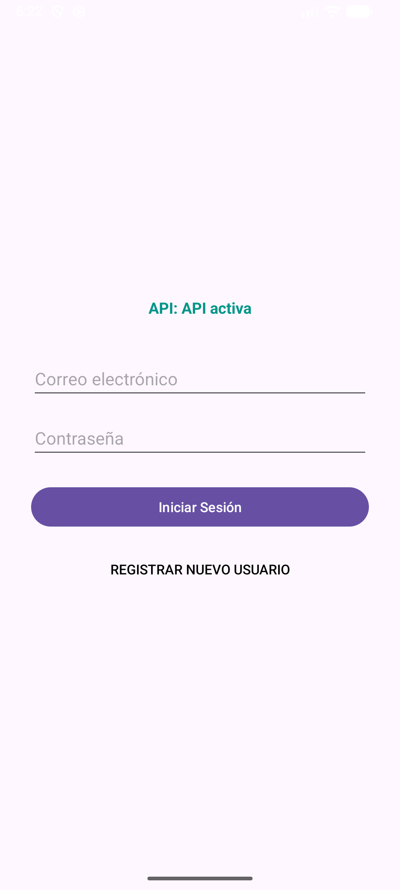
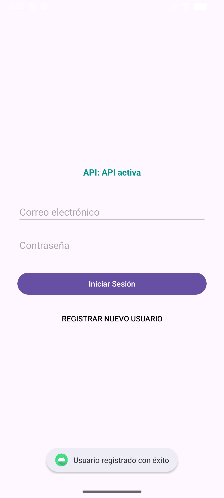
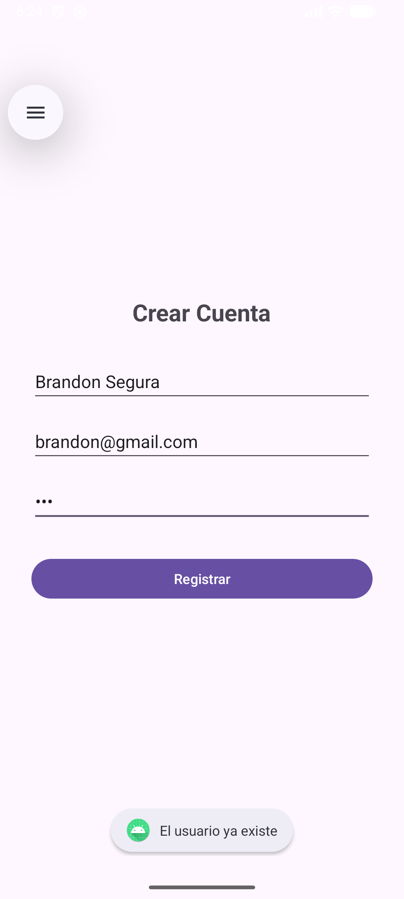
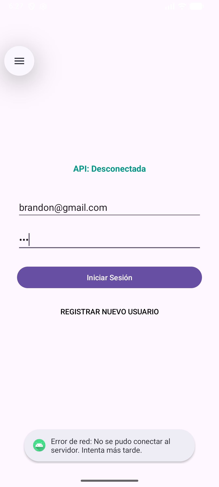

# Aplicación Android - Registro y Autenticación con API REST

Este repositorio contiene el código fuente de una aplicación móvil Android desarrollada en Kotlin que se comunica con un backend en Node.js (desplegado mediante Docker) para gestionar el registro, inicio de sesión y verificación de usuarios.

## Requisitos previos

Para ejecutar este proyecto, necesitas tener instalado:
* **Docker y Docker Compose** (para el backend).
* **Android Studio** (para compilar y emular el frontend).

---

## Instrucciones para compilar y ejecutar el proyecto

### 1. Levantar el Backend (API REST)
1. Abre una terminal y navega hasta la carpeta `Backend` de este repositorio.
2. Construye y levanta el contenedor ejecutando el comando:
   `docker compose up -d`
3. La API estará corriendo localmente en el puerto `5000`.

### 2. Compilar y ejecutar la aplicación Android (Frontend)
1. Abre **Android Studio**.
2. Selecciona la opción **Open** y navega hasta seleccionar la carpeta `Front` de este repositorio.
3. Espera unos momentos a que Gradle sincronice las dependencias del proyecto (Retrofit, Gson, Corrutinas, etc.).
4. Inicia un Emulador de Android (AVD). *Nota: La aplicación está configurada para conectarse a `http://10.0.2.2:5000`, que es la dirección que usa el emulador para apuntar al localhost de tu computadora.*
5. Haz clic en el botón **Run 'app'** (el ícono verde de "Play" en la barra superior) para compilar el APK e instalarlo en el emulador.

---

## Evidencias de Ejecución (Capturas de Pantalla)

A continuación se presentan las capturas de pantalla solicitadas para cada ejercicio, demostrando el correcto funcionamiento de la aplicación y su conexión con la API.

### Ejercicio 1 – Conexión y verificación de la API
*Se realiza una petición GET al endpoint raíz al iniciar la aplicación. El TextView muestra el mensaje de respuesta confirmando la conexión.*

### Ejercicio 2 – Pantalla de Registro
*Petición POST a `/register`. Se muestran los casos de éxito y el manejo del error cuando un usuario ya existe en la base de datos.*

**Caso: Registro Exitoso** 

**Caso: Usuario Duplicado** 

### Ejercicio 3 – Pantalla de Login
*Petición POST a `/login`. Navegación a la pantalla de bienvenida con credenciales correctas y mensaje de error con credenciales incorrectas.*

**Caso: Login Exitoso (Pantalla de Bienvenida)** 

### Ejercicio 4 – Manejo de errores de red
*Comportamiento de la aplicación al intentar hacer login después de detener el contenedor. La app captura la excepción y muestra un mensaje amigable en lugar de cerrarse.*

